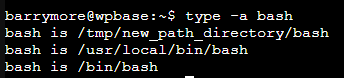

# Домашнее задание к занятию "3.1. Работа в терминале, лекция 1"

### 1. Ознакомьтесь с графическим интерфейсом VirtualBox, посмотрите как выглядит виртуальная машина, которую создал для вас Vagrant, какие аппаратные ресурсы ей выделены. Какие ресурсы выделены по-умолчанию?
   * CPU 2 потока
   * RAM 2 Гб
   * Диск системы 64 Гб формата .VMDK, методика выделения пространства Thin provisioning
   * Сетевой адаптер подключенный через NAT 
### 2. Как добавить оперативной памяти или ресурсов процессора виртуальной машине?
   * VM->Настроить->Система->Материнская плата->Основная память
   * VM->Настроить->Система->Процессор->Процессор(ы)
### 3. Ознакомиться с разделами `man bash`, почитать о настройках самого bash:
   #### 3.1 Какой переменной можно задать длину журнала `history`, и на какой строчке manual это описывается?
   * `HISTSIZE` `630`
  #### 3.2 Что делает директива `ignoreboth` в bash? 
   * Позволяет для опции HISTCONTROL отключить не отбражать в истории команды начинающиеся с пробела(пустые строки) и команды совпадающие с последней выполненной командой. 
### 4. В каких сценариях использования применимы скобки `{}` и на какой строчке `man bash` это описано?
   * В сценариях когда список нужно выполнить в контексте текущей оболочки. Строка `206`
### 5. Основываясь на предыдущем вопросе, как создать однократным вызовом `touch` 100000 файлов? А получилось ли создать 300000? Если нет, то почему?
   * `touch test{000001..100000}` 
   * Нет, bash упрется в `ARG_MAX limit` и выдаст ошибку `Argument list too long`. `ARG_MAX limit` определяет сколько аргументов можно передать одной функцией. Посмотреть текущий лимит аргументов для ОС можно через команду `getconf ARG_MAX`
### 6. В man bash поищите по `/\[\[`. Что делает конструкция `[[ -d /tmp ]]` ?
   * Выводит значение `True` если `/tmp` существует и это директория 
### 7. Основываясь на знаниях о просмотре текущих (например, PATH) и установке новых переменных; командах, которые мы рассматривали, добейтесь в выводе type -a bash в виртуальной машине наличия первым пунктом в списке:

   

   ```bash
   cp /bin/bash /usr/local/bin/
   mkdir /tmp/new_path_directory
   cp /bin/bash /tmp/new_pat
   nano .bashrc
   export PATH=/tmp/new_path_directory:$PATH #в конец файла .bashrc
   type -a bash
   ```
   P.S. Выполнено не на машине Vagrant, но я ее ставил честно-честно
### 8. Чем отличается планирование команд с помощью `batch` и `at`?
   * `at` запускает команды согласно заданному расписанию.
   * `batch` запускает комманды в любое время пока система находиться в простое.
