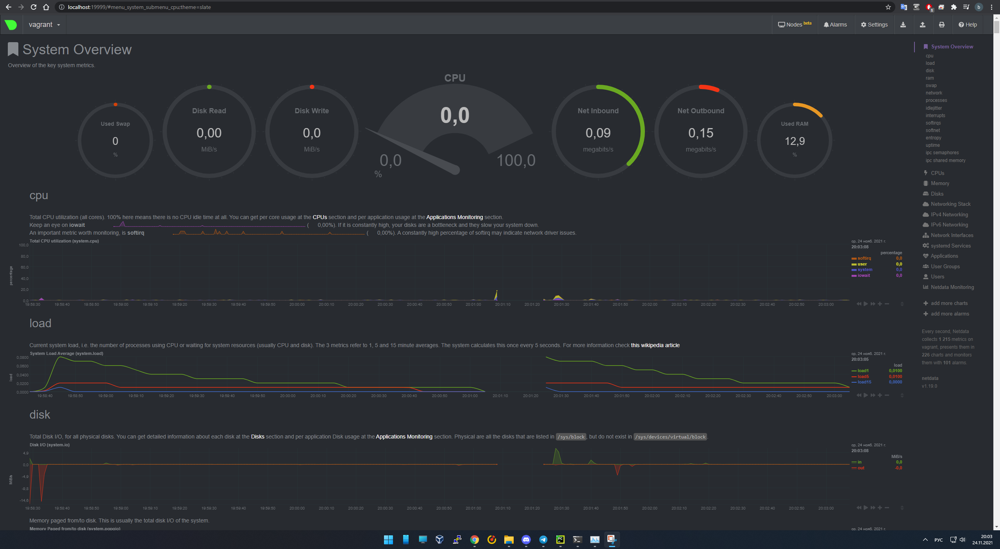

# Домашнее задание к занятию "3.4. Операционные системы, лекция 2"

1. Используя знания из лекции по systemd, создайте самостоятельно простой [unit-файл](https://www.freedesktop.org/software/systemd/man/systemd.service.html) для node_exporter:

```bash 
sudo useradd -r -M -s /bin/false node_exporter #Создаем системного пользователя, от которого будет работать Node Exporter
wget https://github.com/prometheus/node_exporter/releases/download/v1.3.0/node_exporter-1.3.0.linux-amd64.tar.gz
tar -zxpvf node_exporter-1.0.1.linux-amd64.tar.gz
cd node_exporter-1.3.0.linux-amd64
sudo cp node_exporter /usr/local/bin
sudo chown node_exporter:node_exporter /usr/local/bin/node_exporter
```
```bash
sudo nano /etc/systemd/system/node_exporter.service                                                                                  

[Unit]
Description=Prometheus Node Exporter
Wants=network-online.target
After=network-online.target

[Service]
User=node_exporter
Group=node_exporter
Type=simple
EnvironmentFile=/etc/node_exporter/node_exporter.conf
ExecStart=/usr/local/bin/node_exporter $OPTIONS

[Install]
WantedBy=multi-user.target
```
```bash
$ sudo nano /etc/node_exporter/node_exporter.conf
OPTIONS="--collector.ntp"
```
```bash
sudo systemctl daemon-reload
sudo systemctl enable
sudo systemctl start
```
```bash
barrymore@wpbase:~/node_exporter-1.3.0.linux-amd64$ sudo lsof -i -P -n | grep 9100
node_expo 37873   node_exporter    3u  IPv6 2706599019      0t0  TCP *:9100 (LISTEN)
```
2. Ознакомьтесь с опциями node_exporter и выводом `/metrics` по-умолчанию. Приведите несколько опций, которые вы бы выбрали для базового мониторинга хоста по CPU, памяти, диску и сети.
   * CPU `node_load1` `node_load5` `node_load15` `node_cpu_seconds_total`
   * RAM `node_memory_MemTotal_bytes` `node_memory_MemAvailable_bytes`
   * Storage `node_filesystem_free_bytes` `node_filesystem_size_bytes`
   * I/O `node_disk_writes_completed_total` `node_disk_io_time_seconds_total` `node_disk_written_bytes_total` тоже самое для чтения
   * Network `node_network_receive_bytes_total` `node_network_transmit_bytes_total`
3. Установите в свою виртуальную машину [Netdata](https://github.com/netdata/netdata).

4. Можно ли по выводу `dmesg` понять, осознает ли ОС, что загружена не на настоящем оборудовании, а на системе виртуализации?
```bash
root@swzabbix:~# dmesg | grep virt
[    0.015184] Booting paravirtualized kernel on KVM
[    1.306722] virtio_blk virtio2: [vda] 67108864 512-byte logical blocks (34.4 GB/32.0 GiB)
[    1.310610] virtio_net virtio3 ens18: renamed from eth0
[    8.026257] systemd[1]: Detected virtualization kvm. 
 ```
Есть способ проще:
* для гостя будет такой вывод
```bash
root@swzabbix:~# systemd-detect-virt
kvm
```
* а для хоста или baremetal машины такой
```bash
root@proxmox:~# systemd-detect-virt
none
```
5. Как настроен sysctl `fs.nr_open` на системе по-умолчанию? Узнайте, что означает этот параметр. Какой другой существующий лимит не позволит достичь такого числа (`ulimit --help`)?
```bash
barrymore@wpbase:~$ sudo sysctl fs.nr_open
fs.nr_open = 1048576
```
* nr_open - максимальное количество файлов, которое может быть выделено одним процессом
* ulimit -n
6. Запустите любой долгоживущий процесс (не `ls`, который отработает мгновенно, а, например, `sleep 1h`) в отдельном неймспейсе процессов; покажите, что ваш процесс работает под PID 1 через `nsenter`.
```bash
root@wpbase:~# unshare -f --pid --mount-proc /usr/bin/top
```
```bash
root@wpbase:~# ps aux | grep top
root         480  0.0  0.0   2340   520 pts/2    S+   17:55   0:00 unshare -f --pid --mount-proc /usr/bin/top
root         481  0.0  0.6   6988  3348 pts/2    S+   17:55   0:00 /usr/bin/top
root         490  0.0  0.1   3180   716 pts/3    S+   17:57   0:00 grep top
```
```bash
root@wpbase:~# nsenter --target 481 --pid --mount
root@wpbase:/# ps aux
USER         PID %CPU %MEM    VSZ   RSS TTY      STAT START   TIME COMMAND
root           1  0.0  0.0   6988  3348 pts/2    S+   17:55   0:00 /usr/bin/top
root           3  0.0  0.0   4764  4156 pts/3    S    17:57   0:00 -bash
root           6  0.0  0.0   6700  2924 pts/3    R+   17:57   0:00 ps aux
```
7. Найдите информацию о том, что такое `:(){ :|:& };:`. Запустите эту команду в своей виртуальной машине Vagrant с Ubuntu 20.04 (**это важно, поведение в других ОС не проверялось**). Некоторое время все будет "плохо", после чего (минуты) – ОС должна стабилизироваться. Вызов `dmesg` расскажет, какой механизм помог автоматической стабилизации. Как настроен этот механизм по-умолчанию, и как изменить число процессов, которое можно создать в сессии?
* Кострукция `:(){ :|:& };:` является форкбомбой, которая бесконечно создает свои копии (системным вызовом fork()), создавающие свои копии. 
```bash
[Wed Nov 24 20:06:14 2021] cgroup: fork rejected by pids controller in /user.slice/user-1000.slice/session-3.scope
```
* От зависания систему спасает systemd создающий cgroup для каждого пользователя который не дает сожрать все ресурсы системы ограничивая максимальное количество процессов для пользователа  по TasksMax  